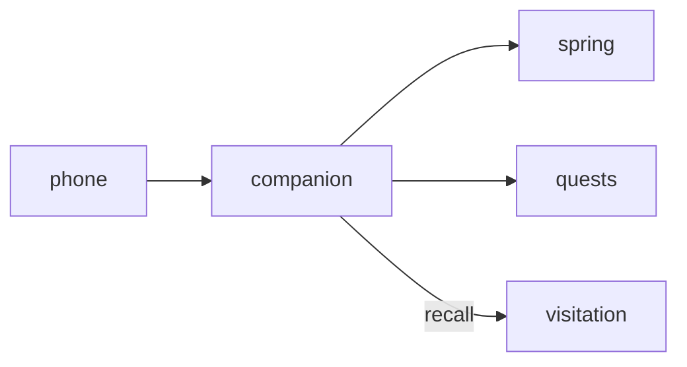

# Companion

**Web Companion** — Mobile-friendly dashboard to manage pets away from the desktop overlay.

Part of [ComputerPets](https://github.com/RicheyWorks/computerpets). Map: [computerpets-ecosystem](https://github.com/RicheyWorks/computerpets-ecosystem).

| | |
| --- | --- |
| Status | Design scaffold — contract frozen, implementation next |
| License | MIT |
| First pet | Still [Rui on the desktop](https://github.com/RicheyWorks/computerpets/blob/main/docs/START-HERE.md). This organ is optional. |

## The job

The desktop walk is the main quest. Companion is the phone: feed, call-back, medicine, and 'is Rui still on the PC?' when you are on the bus.

The flagship overlay already puts a living sticker on the real desktop (Rui first, 210 kinds). Companion does not replace that. It is one organ.

## Who uses it

Players away from the PC. Phone and laptop browser.

## What it is not

Not the desktop overlay. You cannot drag Rui on a phone; you can feed and recall.

## Architecture



## Stack

TypeScript · React 19 · Vite · TanStack Query · Spring Boot API client · PWA

GroupId / namespace: `com.enterprisepet.companion`  
Default listen: `8080`

## Contract

### Data

`PetCard(id, species, vitals, host) · CareAction(kind, ts) · Presence(machineId, lastSeen)`

### Surface

- GET /me/pets — owned pets + vitals (proxied from flagship)
- POST /me/pets/{id}/care — feed | play | rest | clean | medicine
- GET /me/presence — which machine currently hosts the overlay

### Failure doctrine

Desktop offline → queue care actions, sync on return. Auth missing → local demo Rui only, never another user's pet.

## First slice

Build this and stop. Do not boil the ocean.

**Pet card for Rui: vitals, feed/play/rest/clean/medicine, presence of the host machine.**

You know it works when: Backend down: queue care, do not pretend it landed. No auth: local demo Rui only.

## Environment

`VITE_API_BASE` pointing at the Spring backend

Never commit secrets. Never put Steam or chain keys in the overlay.

## Neighbors

- computerpets Spring backend
- computerpets-quests
- computerpets-visitation
- computerpets-telemetry

## Layout

```
computerpets-companion/
  README.md           this file
  LICENSE             MIT
  docs/CONTRACT.md    the same contract, frozen for implementers
  src/                implementation lands here
```

## Run (Windows)

PowerShell, from this folder, after the flagship helpers (Git, Node LTS 22+, JDK 21 as needed):

```powershell
cd app; npm install; npm run dev
```

You do not need this service to meet Rui. The [flagship start-here](https://github.com/RicheyWorks/computerpets/blob/main/docs/START-HERE.md) is still the first pet.

## Links

- Flagship: [RicheyWorks/computerpets](https://github.com/RicheyWorks/computerpets)
- This repo: [RicheyWorks/computerpets-companion](https://github.com/RicheyWorks/computerpets-companion)
- Map: [RicheyWorks/computerpets-ecosystem](https://github.com/RicheyWorks/computerpets-ecosystem)
- Contract file: [docs/CONTRACT.md](docs/CONTRACT.md)

## License

MIT. See [LICENSE](LICENSE).

---

*Two hundred ten living kinds. Keep them so a line does not go quiet.*
